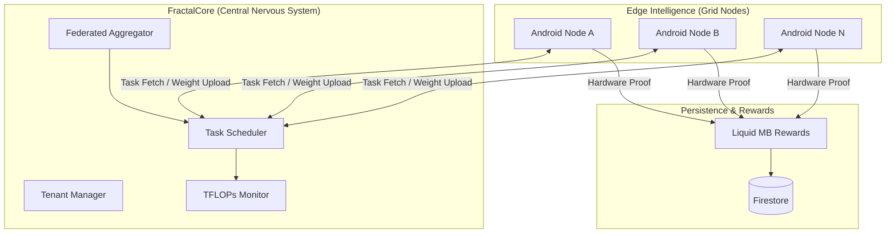
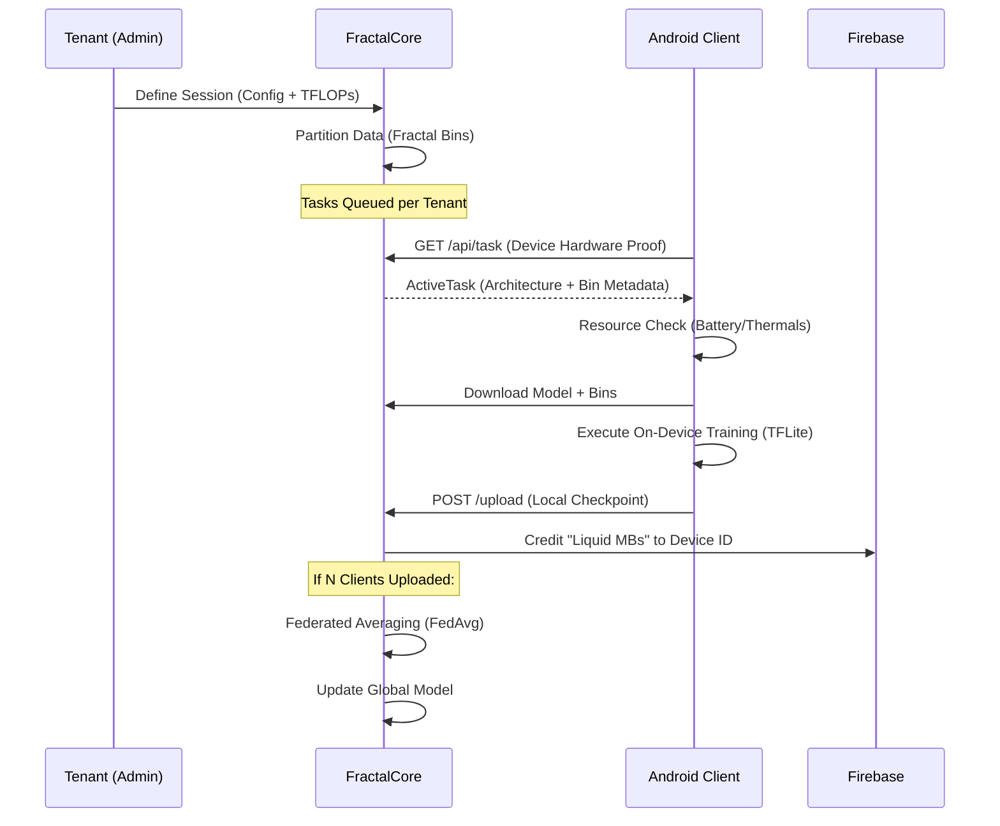

<div align="center">


# F R A C T A L
### Decentralized Compute Orchestration & Edge Intelligence

[](LICENSE)
[](#)
[](#)
[](#)
[-red.svg?style=flat-square)](https://github.com/AhmadHassan-BTed)

**A unified ecosystem for large-scale federated learning, bridging the gap between centralized model evolution and decentralized edge intelligence.**

[Philosophy](#-philosophy) • [Design Presentation](https://www.behance.net/gallery/221459335/Fractal) • [Architecture](#-architecture-overview) • [System Flow](#-system-workflow) • [Core Modules](#-module-breakdown) • [Onboarding](#-getting-started)

</div>

---

## 🌌 Philosophy

Computation is most powerful when it mirrors life: **distributed, adaptive, and collective**. 

**Fractal** is an exploration of "Empathetic Engineering." The system recognizes that every edge device is more than just a processor—it is a tool serving a human being. By moving training to the data, rather than the data to the server, Fractal respects the privacy of the individual while empowering the collective intelligence of the grid. 

In this ecosystem, mobile devices are transformed into autonomous compute nodes that "feel" their environment—backing off when thermals rise or battery drops—ensuring that the machine's progress never comes at the cost of the human experience.

---

## 🏗 Architecture Overview

Fractal is architected as a hierarchical orchestration system. The root workspace manages the synergy between the **FractalCore** (Brain) and the **FractalAndroid** (Edge).

### System Topology



---

## 🔄 System Workflow

The lifecycle of a training task follows a fractal loop of distribution and convergence.

### Request & Data Lifecycle



---

## 📦 Repository Structure

The project is organized to maintain strict separation of concerns between server orchestration and edge execution.

```text
.
├── FractalApp/
│   └── FractalAndroid/      # Android Client (Kotlin/TFLite)
│       ├── app/             # Main Application Logic
│       ├── build/           # Generated Build Artifacts
│       └── ...
├── FractalCore/
│   └── src/
│       └── fractal_server/  # Python Flask Orchestrator
│           ├── global_model/# Global Weights Storage
│           ├── tenants/     # Tenant-specific Data Silos
│           └── server.py    # Main API & Aggregator
├── docs/
│   └── assets/              # Branding & Diagrams
└── private.envs/            # [PRIVATE] Sensitive Keys & Configs
```

---

## 🛠 Module Breakdown

### 🧠 FractalCore (The Orchestrator)
The backend engine designed for multi-tenant isolation and deterministic aggregation.
*   **Tenant System**: Independent data silos and compute budgets per user.
*   **TFLOPs Budgeting**: Real-time monitoring of compute expenditures.
*   **FedAvg Engine**: High-performance weight averaging using TensorFlow.
*   **Firestore Integration**: Real-time synchronization of device registries and rewards.

### 📱 FractalAndroid (The Edge Node)
A resource-aware execution environment for mobile devices.
*   **Synthesis Engine**: Dynamically builds the training environment based on server metadata.
*   **Telemetry Gating**: Monitors battery status, network type, and thermals to protect the host.
*   **Master Pipeline**: An automated Fetch -> Download -> Train -> Upload -> Flush cycle.

---

## 🚀 Getting Started

### Prerequisites
*   **Python 3.10+** (for Core)
*   **Android Studio Jellyfish+** (for App)
*   **Firebase Account** (Firestore enabled)

### Setup & Restoration
This repository uses a private sub-module for sensitive keys and configurations. To restore the environment:

1. Clone the repository including submodules:
   ```bash
   git clone --recursive https://github.com/Fractal-Compute-Orchestrations/FractalWorkspace
   ```
2. Navigate to the private environment directory:
   ```bash
   cd private.envs/Fractal
   ```
3. Run the restoration script to place keys and configs in their correct locations:
   ```powershell
   .\restore.ps1
   ```

---

## 🛡 Security & Privacy
*   **Zero-Data Transfer**: User data never leaves the Android device. Only model weights are transmitted.
*   **Tenant Isolation**: Each tenant's data and models are physically and logically separated.
*   **Token Authentication**: X-Auth-Token based isolation for session security.

---

<div align="center">

**Fractal is an independent engineering initiative by Ahmad Hassan (B-Ted).**

*Contributions to the grid are welcomed. The architecture is designed to scale intentionally.*

</div>
