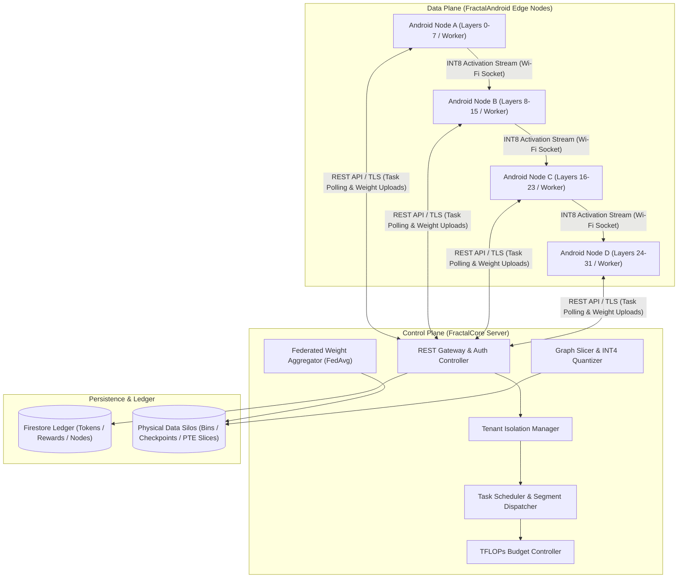
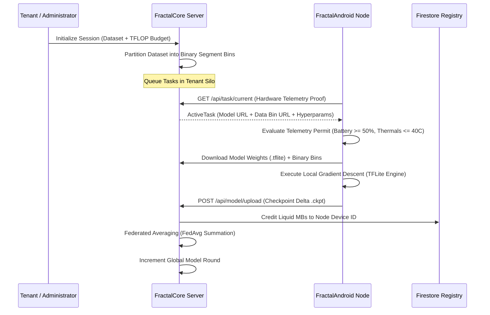

<div align="center">


# Fractal
### Distributed Compute Orchestration and Edge Intelligence Framework

[](LICENSE)
[](#)
[](#)
[](#)
[-red.svg?style=flat-square)](https://github.com/Fractal-Compute-Orchestrations)

**A unified distributed systems framework bridging centralized model orchestration with decentralized edge intelligence.**

[Overview](#overview) | [Architecture](#system-architecture) | [Core Paradigms](#operational-paradigms) | [Repository Topology](#repository-topology) | [Getting Started](#getting-started) | [Security](#security-and-privacy)

---
</div>

## Overview

Fractal is a high-performance distributed computing ecosystem engineered to harvest fragmented consumer compute across mobile edge devices while strictly preserving user privacy and device health. The framework treats edge devices not merely as remote processors, but as autonomous, resource-constrained nodes operating under human-centric constraints.

The ecosystem resolves the computational and memory walls of foundation models through two distinct, unified systems:

1. **FractalCore (Central Server & Orchestrator)**: The Python-based control plane responsible for multi-tenant isolation, dataset segment allocation, model graph compilation/slicing, deterministic federated weight aggregation (FedAvg), compute budgeting, and tokenized reward distribution.
2. **FractalAndroid (Edge Compute Node & Application)**: The native Kotlin/Android execution engine running on mobile hardware. It performs hardware-gated on-device training and memory-mapped inference, dynamically pausing workloads if thermals or battery thresholds are exceeded.

---

## System Architecture

Fractal operates on a hierarchical Master-Worker architecture designed to isolate control signals from mathematical payloads.



---

## Operational Paradigms

Fractal executes distributed machine learning through two foundational paradigms:

### 1. Federated Learning (On-Device Training)

In the federated learning lifecycle, raw training datasets are never transferred to the central server. The server partitions data indices into segment bins, dispatches task descriptors to registered Android nodes, and waits for computed checkpoint deltas (`.ckpt`).



### 2. Decentralized Pipeline Parallelism (Large Foundation Model Inference)

To execute foundation models (such as Llama 3 8B or TinyLlama) across edge devices without triggering the Android Low Memory Killer (LMK), Fractal Core slices the monolithic model into memory-bounded partitions (`layer_[N].pte` <= 150MB). Each Android node memory-maps (`mmap`) an assigned partition and transmits quantized activation tensors across an ad-hoc local mesh.

```mermaid
flowchart LR
    subgraph CoreSlicer ["FractalCore Compiler"]
        M16["Monolithic 16GB FP16 Checkpoint"] --> Ingest["Ingestion & Block Isolation"]
        Ingest --> Quant["INT4 Weight Quantization (torchao)"]
        Quant --> Trace["ATen Dialect Graph Trace (torch.export)"]
        Trace --> Lower["XNNPACK Hardware Delegation"]
        Lower --> Out["32x Mapped Partitions (layer_N.pte <= 150MB)"]
    end

    subgraph EdgeMesh ["Android Compute Mesh"]
        Out -.->|"Deploy Layer Partition"| NodeA["Node A (Input / Layer 0-7)"]
        NodeA -->|"INT8 Activations (<= 4.1KB)"| NodeB["Node B (Layer 8-15)"]
        NodeB -->|"INT8 Activations (<= 4.1KB)"| NodeC["Node C (Layer 16-23)"]
        NodeC -->|"INT8 Activations (<= 4.1KB)"| NodeD["Node D (Output / Layer 24-31)"]
    end
```



---

## Global System Contracts

The ecosystem maintains strict operational boundaries governed by mathematical contracts:

| Contract | Target Subsystem | Strict Specification | Failure Behavior |
| :--- | :--- | :--- | :--- |
| **Weight Contract** | Model Slicing & Storage | Binary partition (`.pte` / `.tflite`) strictly $\le$ 150MB | Slicer compilation rejected |
| **Activation Contract** | Pipeline Inter-Node Network | 4096-dim INT8 tensor + 1 Float scale strictly $\le$ 4,100 bytes | Network frame dropped and re-requested |
| **Telemetry Permit** | On-Device Execution Gate | Battery $\ge$ 50%, Charging == True, Battery Temp $\le$ 40.0 C | Training paused immediately |
| **Authentication Contract** | REST Ingress Gateway | `X-Auth-Token` required for all tenant and administrative routes | HTTP 401 / 403 response |
| **Upload Validation** | Federated Aggregation Gate | `task_Id` must match an active unconsumed dispatch record | HTTP 400 Unknown task_Id |

---

## Repository Topology

The Fractal ecosystem is partitioned across dedicated modular repositories:

```text
.
|-- FractalApp/
|   `-- FractalAndroid/              # Client Application & Compute Node (Kotlin)
|       |-- app/src/main/java/       # Native MVVM Architecture
|       |   |-- AppBackend/          # Telemetry, TFLite Engine, Checkpointing, DAOs
|       |   `-- AppFrontend/         # Telemetry Dashboard, Insights & Settings
|       |-- build.gradle.kts         # Android Build Configuration (Kotlin DSL)
|       `-- docs/                    # Architecture diagrams and specifications
|
|-- FractalCore/                     # Server & Control Plane (Python)
|   |-- src/
|   |   |-- fractal_server/          # Multi-Tenant Flask API & Federated Aggregator
|   |   `-- inference-model-maker/   # Slicer Compiler & Model Partitioning Pipeline
|   |-- scripts/                     # Operational Sweepers, Testers & Reward Audits
|   |-- docs/                        # API schemas, deployment, and security specs
|   |-- Dockerfile                   # Production Container Definition
|   `-- docker-compose.yml           # Multi-Container Orchestration Stack
|
|-- docs/                            # Unified Project Whitepapers & Reports
`-- private.envs/                    # Private Environment Configurations & Service Keys
```

---

## Getting Started

### Prerequisites

- **Python**: Version 3.10 or higher
- **Android Studio**: Version 2023.3.1 (Jellyfish) or newer
- **Android Device**: Physical device running Android API 24+ (ARM64 recommended)
- **Google Cloud Platform**: Firebase Project with Firestore enabled

### Cloning with Submodules

To initialize the entire workspace including all submodule repositories:

```bash
git clone --recursive https://github.com/Fractal-Compute-Orchestrations/FractalWorkspace.git
```

If the repository was cloned without `--recursive`, initialize submodules manually:

```bash
git submodule update --init --recursive
```

### Initializing the Orchestrator (FractalCore)

```bash
cd FractalCore
cp .env.example .env

# Launch production server via Docker Compose
docker-compose up --build -d

# Verify server status
curl http://localhost:5000/api/admin/tenants
```

### Initializing the Edge Client (FractalAndroid)

```bash
cd FractalApp/FractalAndroid

# Build project with Gradle
./gradlew assembleDebug

# Install on connected physical device
./gradlew installDebug
```

---

## Security and Privacy

- **Zero Data Ingress**: The central server never ingests, stores, or processes raw user datasets. Only compiled mathematical weight checkpoints are transmitted.
- **Stateless Token Authentication**: Authentication is enforced exclusively through the `X-Auth-Token` request header. Tokens are cryptographically generated (`secrets.token_hex(32)`) and isolated from browser cookies to eliminate cross-tab session leakage.
- **Physical Tenant Sandboxing**: Multi-tenancy is enforced at the storage engine level. Each tenant's datasets, bins, and intermediate checkpoints are sandboxed in isolated directory trees (`data/tenants/{username}/`).
- **Replay Protection**: Checkpoint uploads require a valid, non-expired, single-use `task_Id`. Stale or duplicate uploads are rejected at the ingress gate.

---

## Governance & Maintenance

Fractal is an open engineering initiative architected by **[Ahmad Hassan (B-Ted)](https://github.com/Fractal-Compute-Orchestrations)**.

- Code of Conduct: See [CODE_OF_CONDUCT.md](CODE_OF_CONDUCT.md)
- Contribution Guidelines: See [CONTRIBUTING.md](CONTRIBUTING.md)
- Security Disclosure: See [SECURITY.md](SECURITY.md)
- License: Open-source under the [Apache License 2.0](LICENSE)
