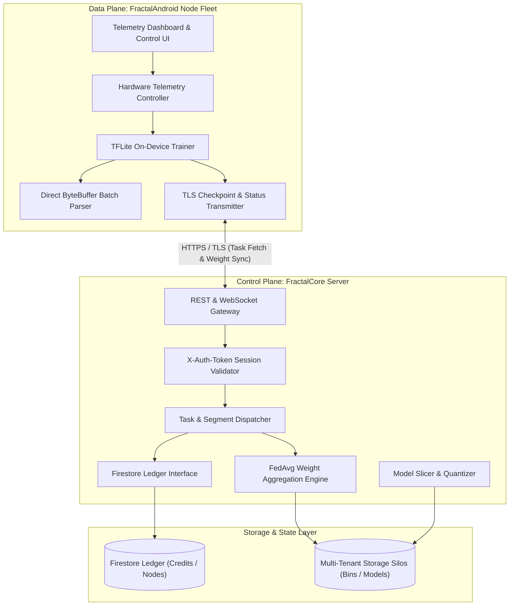

<div align="center">

# Fractal: Architecture and Technical Specifications
### Unified Distributed Systems Framework for Decentralized Intelligence

[](../LICENSE)
[](#)
[](https://www.behance.net/gallery/221459335/Fractal)
[](#)
[](#)

[System Architecture](#system-architecture) | [Design Case Study](https://www.behance.net/gallery/221459335/Fractal) | [Core Subsystems](#core-subsystems) | [Data Contracts](#data-contracts-and-network-protocols) | [Submodule Topology](#submodule-topology) | [Security](#security-architecture)

---
</div>

## System Architecture

The Fractal platform unifies two core computing tiers:

1. **The Orchestration Server (`FractalCore`)**: A centralized control plane managing task lifecycle, multi-tenant filesystem sandboxing, model slicing pipelines, and deterministic weight aggregation.
2. **The Mobile Execution Node (`FractalAndroid`)**: A distributed execution runtime running on edge hardware, enforcing strict telemetry gating (thermal, battery, RAM) and performing local gradient computation and pipeline inference.



---

## Core Subsystems

### 1. FractalCore: Server & Control Plane

- **Multi-Tenant Sandboxing**: Enforces physical filesystem isolation per tenant (`data/tenants/{username}/`). Datasets, binary segments, and checkpoint uploads remain physically and structurally segregated in independent directory trees.
- **Federated Averaging Engine**: Implements synchronous and asynchronous model parameter aggregation. Once threshold uploads are collected for an active round, parameter tensors are averaged and serialized into the new global model checkpoint.
- **Model Slicer & Graph Lowering**: Transforms large foundation models into atomic INT4 layer partitions (`layer_[N].pte` <= 150MB) targeted for ARM NEON acceleration via XNNPACK.
- **TFLOPs Budgeting & Liquid Rewards**: Tracks client contributions against session compute budgets, crediting rewards to device hardware profiles in Firestore.

### 2. FractalAndroid: Edge Compute Node

- **Hardware Telemetry Gating (`OperationControl`)**: Continuously samples device thermals, battery state-of-charge, charging status, and memory pressure. Computation is automatically throttled or suspended if:
  - Battery level < 50% (unless actively connected to AC power).
  - Battery temperature > 40.0 degrees Celsius.
  - Device enters active interactive user foreground demands.
- **Direct Buffer Batch Parsing (`DataManager`)**: Uses direct ByteBuffers for efficient binary dataset decoding, avoiding unnecessary garbage collection pressure on the Android runtime.
- **On-Device Local Training (`Image_Trainer`)**: Executes gradient descent over assigned binary data segments without exposing user data to the network.

---

## Data Contracts and Network Protocols

| Contract Name | Technical Specification |
| :--- | :--- |
| **Weight Contract** | Binary partition file (`.pte` / `.tflite`) $\le$ 150MB |
| **Activation Contract** | 4096-element INT8 array + 1x Float32 scale (4,100 bytes) |
| **Task Request** | `GET /api/task/current` with `device_id` query parameter |
| **Checkpoint Upload** | `POST /api/model/upload` (multipart: `task_Id`, `.ckpt` file) |
| **Auth Header** | `X-Auth-Token: <64-character hex string>` |

---

## Submodule Topology

The workspace maintains submodules to decouple backend services from client applications:

- `FractalCore/`: Contains server runtime, slicer pipeline, scripts, and docker orchestration.
- `FractalApp/FractalAndroid/`: Contains Android Studio project, Kotlin modules, and UI assets.

### Submodule Synchronization

```bash
# Clone all repositories recursively
git clone --recursive https://github.com/Fractal-Compute-Orchestrations/FractalWorkspace.git

# Pull updates across all submodules
git pull origin master
git submodule update --recursive --remote
```

---

## Security Architecture

- **Stateless Authorization**: All protected endpoints require a validated `X-Auth-Token` header. No session state is leaked across browser contexts.
- **Task Identity Validation**: Client uploads are verified against active, unconsumed task IDs stored in memory to eliminate replay attacks.
- **Zero Raw Data Transfer**: Raw training inputs never leave the mobile device boundary; only mathematical weight deltas are transmitted.

---

*Authored and maintained by Ahmad Hassan (B-Ted).*