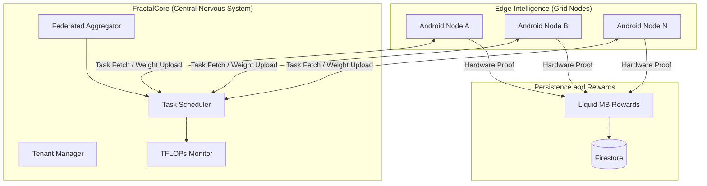
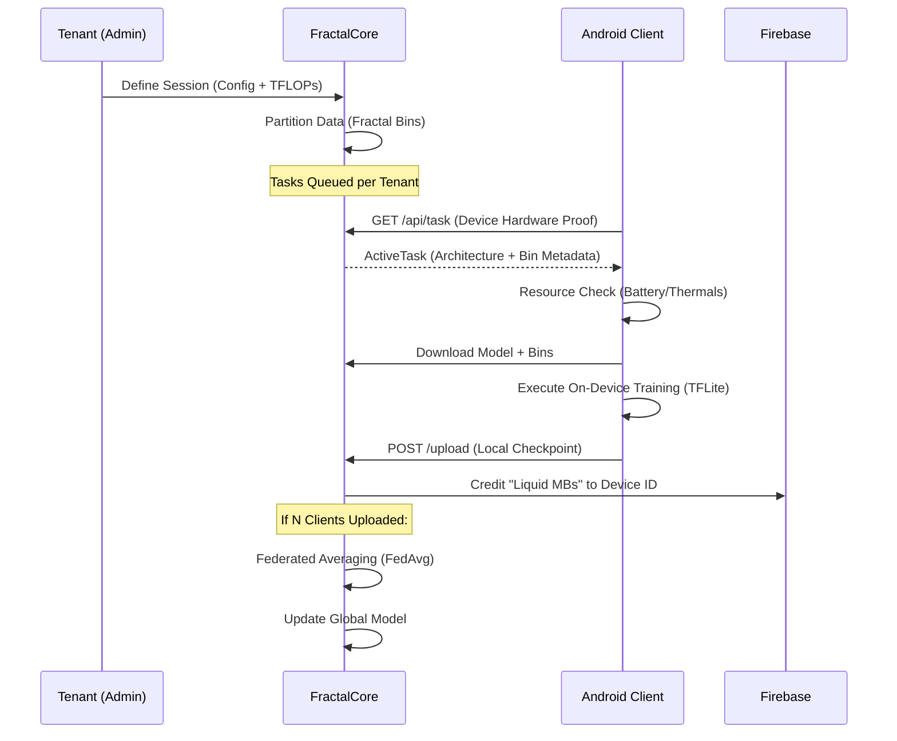
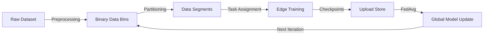

# Fractal

**Decentralized Compute Orchestration and Edge Intelligence**

[License](LICENSE) | [Architecture](#architecture-overview) | [System Workflow](#system-workflow) | [Module Breakdown](#module-breakdown) | [Getting Started](#getting-started)

---

## Overview

Fractal is a unified ecosystem for large-scale federated learning, bridging the gap between centralized model evolution and decentralized edge intelligence. The system transforms mobile devices into autonomous compute nodes that respect device constraints while contributing to collective model improvement.

Computation is most powerful when it mirrors life: distributed, adaptive, and collective. By moving training to the data, rather than the data to the server, Fractal respects the privacy of the individual while empowering the collective intelligence of the grid.

---

## Architecture Overview

Fractal is architected as a hierarchical orchestration system. The root workspace manages the synergy between the **FractalCore** (orchestrator) and the **FractalAndroid** (edge client).

### System Topology



---

## System Workflow

The lifecycle of a training task follows a fractal loop of distribution and convergence.

### Request and Data Lifecycle



---

## Repository Structure

The project is organized to maintain strict separation of concerns between server orchestration and edge execution.

```text
.
├── FractalApp/
│   └── FractalAndroid/      # Android Client (Kotlin/TFLite)
│       ├── app/             # Main Application Logic
│       ├── build/           # Generated Build Artifacts
│       └── ...
├── FractalCore/
│   └── src/
│       └── fractal_server/  # Python Flask Orchestrator
│           ├── global_model/# Global Weights Storage
│           ├── tenants/     # Tenant-specific Data Silos
│           └── server.py    # Main API and Aggregator
├── docs/
│   └── assets/              # Branding and Diagrams
└── private.envs/            # [PRIVATE] Sensitive Keys and Configs
```

---

## Module Breakdown

### FractalCore (The Orchestrator)

The backend engine designed for multi-tenant isolation and deterministic aggregation.

- **Tenant System**: Independent data silos and compute budgets per user.
- **TFLOPs Budgeting**: Real-time monitoring of compute expenditures.
- **FedAvg Engine**: High-performance weight averaging using TensorFlow.
- **Firestore Integration**: Real-time synchronization of device registries and rewards.

### FractalAndroid (The Edge Node)

A resource-aware execution environment for mobile devices.

- **Synthesis Engine**: Dynamically builds the training environment based on server metadata.
- **Telemetry Gating**: Monitors battery status, network type, and thermals to protect the host.
- **Master Pipeline**: An automated Fetch -> Download -> Train -> Upload -> Flush cycle.

---

## Getting Started

### Prerequisites

- Python 3.10+ (for Core)
- Android Studio Jellyfish+ (for App)
- Firebase Account (Firestore enabled)

### Setup and Restoration

This repository uses a private sub-module for sensitive keys and configurations. To restore the environment:

1. Clone the repository including submodules:
   ```bash
   git clone --recursive https://github.com/Fractal-Compute-Orchestrations/FractalWorkspace
   ```

2. Navigate to the private environment directory:
   ```bash
   cd private.envs/Fractal
   ```

3. Run the restoration script to place keys and configs in their correct locations:
   ```powershell
   .\restore.ps1
   ```

---

## Security and Privacy

- **Zero-Data Transfer**: Raw training data never leaves the Android device. Only locally-computed weight checkpoints are transmitted — the server never sees the underlying dataset.
- **X-Auth-Token Authentication**: Every protected endpoint is guarded by `_get_auth()`, which resolves identity exclusively from the `X-Auth-Token` request header. Tokens are issued via `secrets.token_hex(32)` at login, stored server-side in a thread-safe `_token_store`, and revoked on logout. No cookie fallback exists — a deliberate design decision that prevents session bleed across browser tabs; each tab holds its own token in `sessionStorage`.
- **Tenant Filesystem Isolation**: Each tenant's training data, upload checkpoints, and global model checkpoint reside under a physically separate directory tree (`data/tenants/{username}/`). There is no shared mutable path between tenants at the filesystem level.

---

## FractalCore Deep Dive

FractalCore is a high-performance, multi-tenant orchestration engine designed for large-scale Federated Learning. It serves as the intelligent bridge between centralized model evolution and decentralized edge intelligence, ensuring privacy-first collaborative growth.

### Internal Data Pipeline



### Request Security and Routing

- **X-Auth-Token Authentication**: All tenant and admin interactions are authenticated via `_get_auth()`, which reads the `X-Auth-Token` request header exclusively. Tokens (`secrets.token_hex(32)`) are issued at login, invalidated on logout, and stored in a thread-safe in-memory store backed by `tokens.json`. The deliberate absence of a cookie fallback is what enforces tab-level session isolation.
- **Tenant Filesystem Isolation**: Multi-tenancy is enforced at the filesystem level. Each tenant owns a private directory subtree (`data/tenants/{username}/bins`, `uploads`, `global_model`). There is no shared mutable state between tenants on disk.
- **Task-ID–Bound Upload Validation**: Client checkpoint uploads are cross-referenced against `_global_task_tenant_map` keyed by `task_Id`. Uploads with an unknown or already-consumed task ID are rejected with `400 Unknown task_Id`, preventing stale or replayed weight injection.

### FractalCore Repository Structure

| Directory | Purpose |
| :--- | :--- |
| `src/fractal_server` | Core Orchestrator: The production-grade multi-tenant engine. |
| `src/experimental` | Research Lab: Legacy versions and simplified single-user tests. |
| `docs/` | Knowledge Base: Deep technical specifications and API docs. |
| `scripts/` | Ops Tooling: Automated resetters, reward testers, and maintenance. |
| `tests/` | Quality Control: Integration and unit testing suites. |
| `.github/` | Automation: CI/CD workflows and contributor templates. |

### FractalCore Quick Start

```bash
# 1. Prepare Configuration
cp .env.example .env

# 2. Launch Orchestration via Docker
docker-compose up --build -d

# 3. Access Dashboard
# Navigate to http://localhost:5000
```

---

## Submodule Management

Project Fractal relies on Git submodules to partition orchestrator backend services (FractalCore) from client-side edge codebases (FractalAndroid).

### Cloning the Repository

To clone this repository with all its submodules populated:

```bash
git clone --recursive https://github.com/Fractal-Compute-Orchestrations/FractalWorkspace.git
```

If you cloned without `--recursive`, run:

```bash
git submodule update --init --recursive
```

### Pulling Updates

When pulling changes from the master branch, submodules do not update automatically. Run:

```bash
git pull origin master
git submodule update --recursive --remote
```

### Working Inside Submodules

When making changes within submodules, remember that they point to specific commits. Before committing in a submodule:

1. Navigate to the submodule directory (e.g. `FractalCore`).
2. Checkout the active development branch (e.g. `git checkout master`).
3. Commit and push from the submodule first before updating the reference pointer in the main workspace repo.

---

## Contributions

New perspectives and technical improvements are welcomed. Fractal is an evolving system, and contributions help refine the edge of distributed intelligence.

- **Found a bug?** Open a detailed Issue.
- **Want to improve the core?** Follow the Contributing Guide.
- **Security concern?** Consult the Security Policy.

---

## License

Fractal is open-source software licensed under the [Apache License 2.0](LICENSE).

---

*Fractal is an independent engineering initiative by Ahmad Hassan (B-Ted). Orchestrating the future of collective intelligence.*